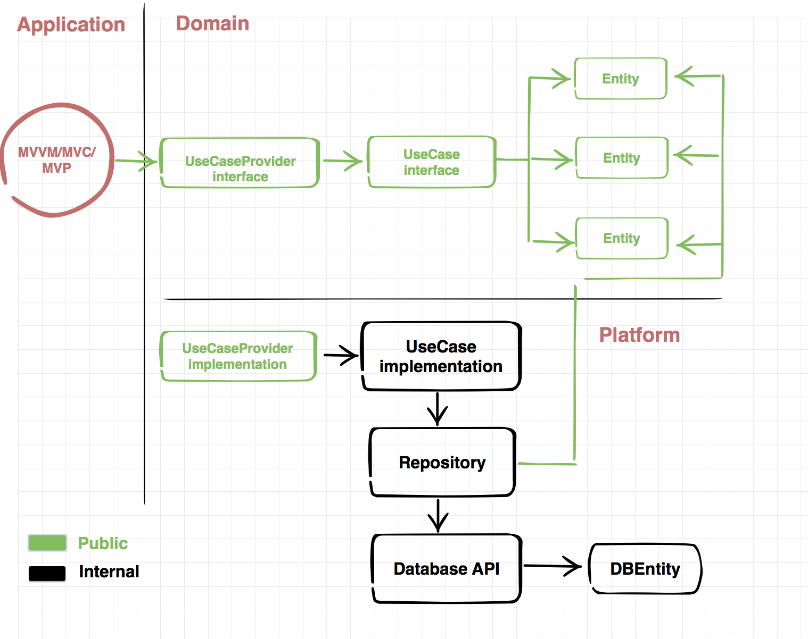

App
============

This project has been developed to show the way I write/organize code with Swift4.

What does it do?

It fetches a json with a list of items, displays them in a map and a list. It also tracks user location.

The most important thing to notice is the way this app is architectured, trying to stick to SOLID principles, keeping dependencies to the minimum, compatibiity

## App Overview

### MkMapView

### **Features**
- Clustering (iOS 11).
- Custom annotation + annotation views, showing the fuel percentage.
- User location that updates when the user moves.
- Center on user's location with the bottom right action button.
- Easy access to list mode.

### Annotation Details

### **Features**
- Custom callout view with bottom arrow.
- Exterior and interior status right here.
- All important data, like name and fuel.
- Address, split in two different concepts {Street data, City data}.
- Distance to current location to know how far is it.
- Two different actions. All detected using HitTest methods.

### UITableView

### **Features**
- Custom cell UI and logic with system's UITableView.
- Pull to refresh.
- Same info as in map's annotation callout.

# Git

Using Gitflow:

* Master (Releases here)
* Hotfixes (Production fixes that don't get to mix with current development)
* Dev (Latest stable version)
* For each feature, a branch is created from Dev and then merged into it.

Using .gitignore for Swift & Xcode

# Code Style
Swiftlint configuration file is contained inside App > Code > Project > .swiftlint.yml (hidden file!)
Script to unify and encourage a standard style, included in App > SyntaxScripts > ./styleMe.py

Very useful for teams, could be integrated as a pre-commit hook.

# Architecture

### Clean architecture

Makes everything isolated, testable, reusable, scalable.

**Domain**
- Business logic
- Model definition
- Reusable across different systems (Mac/iPhone/Watch)
- Trying to take dependencies to the minimum (UIKit or external)
- Interfaces (Protocols) for datasource, persistence, communication, ... that abstract the logic from implementations

**Platform**
- Concrete implementation for the protocols in Domain layer
- Network communication {static, api}
- Persistence {static, disk, Core Data, User Defaults}

**Application**

Logic related to the app itself:
- Life cycle
- Scenes / Views (Model + View + Presenter + Navigator)
- UIControls

### Redux

Based on:
- **State**: immutable
- **Actions**: Triggers for state change
- **Reducers**: Contains all the logic, given a current state, and an action, calculates the following state.

I've worked with:

* Model-View-Presenter (+ Navigation)
* Redux
* VIPER
* Massive View Controller (Apple)
* Model-View-ViewModel + Rx

### Reactive
Using RxSwift for operations and UI as it's really nice to use, compose, filter, transform, ...

## Translations
Project is ready to use several languages, although as few strings are used, a // TODO: is marked to translate when needed.

This project is using literal strings in English only, to simplify.

### Log system
Using different log levels, and never in production to increase performance and security

### Frameworks
All is split into a clean architecture with frameworks for:
* **Project:** Views, UIClasses, etc.
* **Domain:** Models, classes, use cases and providers.
* **Network Kit (Will be library):** Model definition for network interaction
* **Network Kit Alamofire (Will be library):** Model definition for network interaction with Alamofire, contains an HTTP implementation.
* **Network Specific:** Basically, model definition for this project, if all requests used a similar and standard structure, like "status", "data", "serverMessage", ... it would be defined here.
* **PlatformNetworkStatic:** Implementation for Use Cases which are NOT connecting to anything (mocks).
* **PlatformNetworkApi:** Implementation for Use Cases which are connecting to the API with different environments [develop | integration | demo | production].
* **PlatformPersistenceStatic:** Implementation for Use Cases which are NOT reading from any source (mocks)
* **PlatformPersistenceDisk:** Implementation for Use Cases which are actually reading from a valid source (disk, json, user defaults, core data, ...)
* **SharedUtils (Will be several libraries):** Project utils I often use for my projects:
- Foundation Utils
- UIKit Utils
- Randomizers
- ...

When a project ends, this gets be refactored into different libraries to use them afterwards.

### Classes

#### Application
* Dependencies and frameworks initialization.
* Configuration for data source (static / network) and environment with utility methods to switch them dynamically on the run.
* Configuration for persistence (static / disk)  with utility methods to switch them dynamically on the run.
* Redux initialization and components

#### Common
* Extensions: Common extensions that can be refactored into a library.
* ExtensionsSpecific: Extensions that are for this project only.
* Models:
  * Constants: Defined for the project.
  * Theme Color: Holds the color palette.
* UIClasses: Definition of specific components for the project.

#### View Controllers / Scenes
* **Navigator**: Handles initialization of the scene, navigation in and out of it.
* **Presenter**: Handles all the state and logic in the scene.
* **ViewController**: Handles all the view operations, doesn't contain any business logic.
  - Everything arranged so files are always less than 400 max. lines.
  - UIViewController split in extensions for UITableView, MKMapView, Redux State, etc.
  - Subviews like annotations, cells, etc, all in its own reusable files.

#### Own Frameworks
* Defined in here, indepent so they can be extracted in its own library or libraries.

### Dependencies
I usually use CocoaPods although I've worked with Carthage as well.

### Code Autogeneration
Using Sourcery to auto generate code like:
* Hashable methods
* Equal
* Enum utilities
* ...

Really useful to get for free all these methods without mistakes and maintenance

## Environments

To be able to hot switch to integration / demo / production, or static responses, everything in runtime or compilation.

## Future possible Improvements

### Features
* Permission View
* Use custom "Averta" Font
* Quick welcome walkthrough
* *What's new* view for app updates
* Vehicle details view
* Show routes
* Pay from the app (Stripe?)
* Profiles
* ...

### Fastlane

Implemented in many of my projects to:

* Automate Certificate generation / sharing
* Automate Provisioning profile generation / sharing
* Automate screenshots in different languages
* Automate metadata upload to the App Store
* Automate Binary upload to the App Store

### Jenkins
* Integrate fastlane in Jenkins.
* Run tests before building
* Use the latest stable status from development into a nightly build.
* Release to the store with one click.

### Analytics
* Integrate Firebase or tracking methods to analyze and make better business decisions based on data.

### Crash system
* Integrate a crash system (Fabric + Crashlytics)

### Push notifications ready
* Include mock notifications (Simulator remote notifications)
* Include real notifications (with JWT / Certificates / Apple push token)

### Unit Testing
* TDD
* Helps writing pure methods / specification
* All frameworks have its own test linked. In this project I haven't tested many things, as it's only for demo purposes, but what should be tested:
  - Application. Presenters or utils for TDD. UI Testing or interaction/behaviors too.
  - Domain. All the business logic remains in here .
  - Platform(xxx): Could be tested but not really where the effort should be put into.

### About me

If you have any question, comment, want to fork this project, ... you can do pretty much anything with it. If you use my personal Helpers/Categories/Models I'll be glad if you just wrote a mention in your project, send me an email or buy me a beer (that would do it :P).

Vicente Crespo Penadés

[LinkedIn] - My LinkedIn profile

[Email] - Send me an email

License
----

MIT

## License
Created by Vicente Crespo Penadés - vicente.crespo.penades@gmail.com
Copyright (c) 2018 Vicente Crespo  All rights reserved.

[LinkedIn]:https://www.linkedin.com/in/vicente-crespo-penad%C3%A9s-a49a4942/
[Email]:mailto:vicente.crespo.penades@gmail.com
